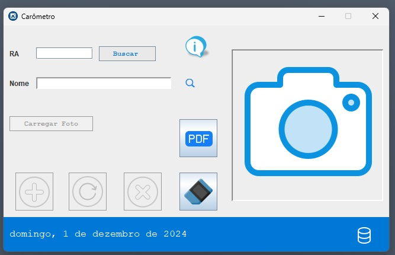

# Projeto de Sincronização de Dados com MySQL em Java

Este projeto tem como objetivo realizar a sincronização dinâmica de dados entre uma aplicação Java e um banco de dados MySQL. Ele permite o cadastro, atualização, exclusão e recuperação de dados do banco, com estrutura organizada para garantir a boa gestão dos dados e a validação de campos na aplicação.

## Estrutura do Projeto

Abaixo está a organização dos pacotes e suas respectivas funcionalidades:

## Imagem da Tela do Aplicativo

Abaixo está uma captura de tela do aplicativo em execução. A imagem mostra a interface principal da aplicação.




### Pacote `model`
Contém a classe `DAO` (Data Access Object), responsável pela conexão com o banco de dados MySQL e pela execução das operações de CRUD (Create, Read, Update, Delete).

- **Classe DAO**: Responsável pela conexão com o banco de dados MySQL e execução das consultas para sincronização de dados entre a aplicação e o banco.

### Pacote `util`
Contém a classe `Validador`, com métodos para validar dados inseridos nos campos da aplicação, evitando conflitos e garantindo que os dados estejam no formato correto antes de serem processados.

- **Classe Validador**: Oferece funções para validar caracteres em campos específicos, como nome, e-mail, entre outros. A validação garante que dados inconsistentes não sejam enviados para o banco, prevenindo falhas.

### Pacote `view`
Contém a interface principal da aplicação e a classe sobre o projeto.

- **Classe Carometro**: Representa a aplicação principal, onde o usuário interage com a interface para cadastrar, atualizar, excluir e visualizar os dados.
  
- **Classe Sobre**: Contém informações sobre a licença do produto, autor do projeto e o repositório onde o código está armazenado.

## Funcionalidades

- **Cadastro de Dados**: O usuário pode cadastrar novos dados, que são sincronizados automaticamente com o banco de dados MySQL.
  
- **Atualização de Dados**: Dados existentes podem ser recuperados, atualizados e sincronizados com o banco.
  
- **Exclusão de Dados**: O sistema permite a exclusão de registros no banco de dados, refletindo a mudança na aplicação.

- **Validação de Campos**: Antes de inserir ou atualizar os dados, o sistema valida campos específicos, como e-mails e nomes, para garantir que estejam corretos.

## Como Executar o Projeto

### Pré-requisitos
1. Banco de dados MySQL configurado e instalado no computador.
2. Java 8 ou superior instalado.
3. Dependências do MySQL para Java (JDBC) incluídas no projeto.

###Configure o Banco de Dados
1. Nome do Banco de Dados O banco de dados utilizado neste projeto é o bdcarometro, mas você pode criar o seu próprio banco de dados com o nome que preferir.
2. No código-fonte Java, dentro da classe DAO.java, você deve configurar a URL do banco de dados, o usuário e a senha para a conexão.
3. O nome do banco de dados é bdcarometro, mas você pode alterar o nome do banco conforme sua preferência. A senha do banco está configurada como vazia no código, mas você deve definir sua própria senha ao instalar e configurar o MySQL.
4. 


### Passos para Execução

1. **Clone o Repositório**:
   ```bash
   git clone https://github.com/seu-usuario/seu-repositorio.git

###Estruturas das Tabelas no Banco de Dados MySQL

O banco de dados MySQL e tabela principal para o armazenamento dos dados:

```sql
CREATE DATABASE bdcarometro;

CREATE TABLE alunos (
    ra INT PRIMARY KEY AUTO_INCREMENT,
    nome VARCHAR(30) NOT NULL,
    foto LONGBLOB NOT NULL
);


/Projeto-Carometro
│
├── /src
│   ├── /model
│   │   └── DAO.java              # Classe responsável pela conexão com o banco de dados MySQL e execução de operações CRUD
│   │
│   ├── /util
│   │   └── Validador.java        # Classe contendo métodos para validação de campos específicos
│   │
│   └── /view
│       ├── Carometro.java        # Classe representando a aplicação principal, interface de interação com o usuário
│       └── Sobre.java            # Classe com informações sobre o projeto, autor e licença
│
└── README.md                    # Arquivo contendo informações sobre o projeto


